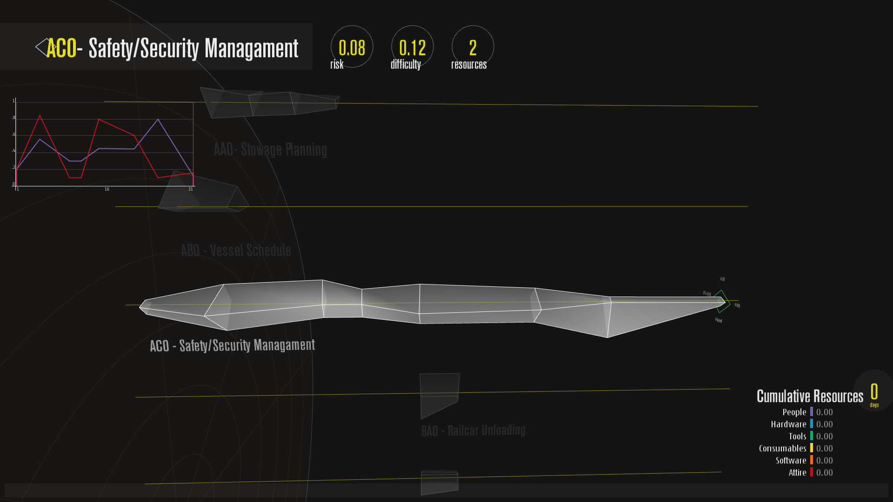
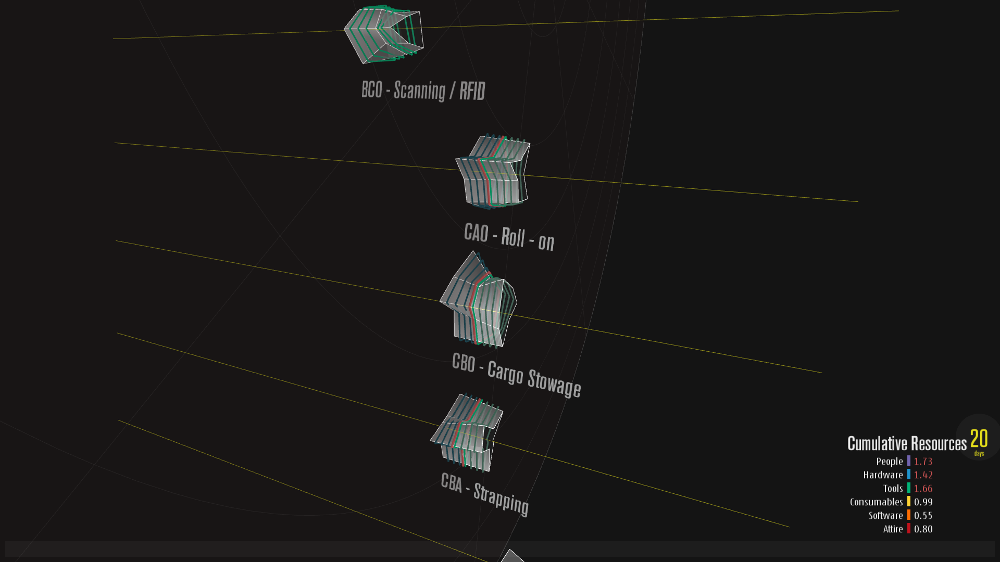
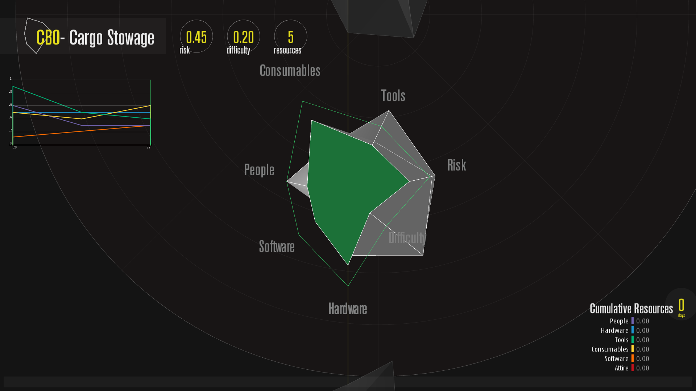

# Task Analysis Visualization

The aim of the project was to develop a data visualization tool for analyzing multiple tasks in the work environment. Tasks are defined with five parameters, namely title, temporal values, riskiness, workload, and multiple resources. Final system should reveal possible resource conflicts in an obvious way.

### Couple of screenshots

[Interaction video](https://vimeo.com/194406252)

[Course webpage](mat.ucsb.edu/~g.legrady/academic/courses/16f594/mert/mert.html)

# Dependencies

* [Processing](https://processing.org/download/)
* [Peasycam Library](http://mrfeinberg.com/peasycam/)

# File Structure

* data *(fonts and data)*
	* data.pde *(another sketch to generate a random number of tasks)*
- et_cetera
	* design
	* second_design_2d
+ second_design.pde
* Task.pde
- Interaction.pde
+ GUI.pde

# Keyboard Shortcuts and Mouse Interaction

## Keyboard

* **T** toggles global placement of tasks between global polar placement to line-up placement
* **R** shows/hides all resource conflicts on tasks 
* **L** reloads data from 'tasks.csv'
* **1** toggles the graph on selection view between line graph and area graph 
* **Space** starts/stops time animation
* **Ctrl+p** takes a screenshot and saves it in current directory

## Mouse

* **Left Drag** rotates the view 
* **Middle Drag** pans current view
* **Mouse Wheel** zooms in and out
* **Right Drag** zooms in and out

* **Double-click** selects a task
* **Triple-click** selects a task and focuses it 

***When a task is currently selected:***

* **Mouse Wheel** scrolls selected slice back and forth on the task